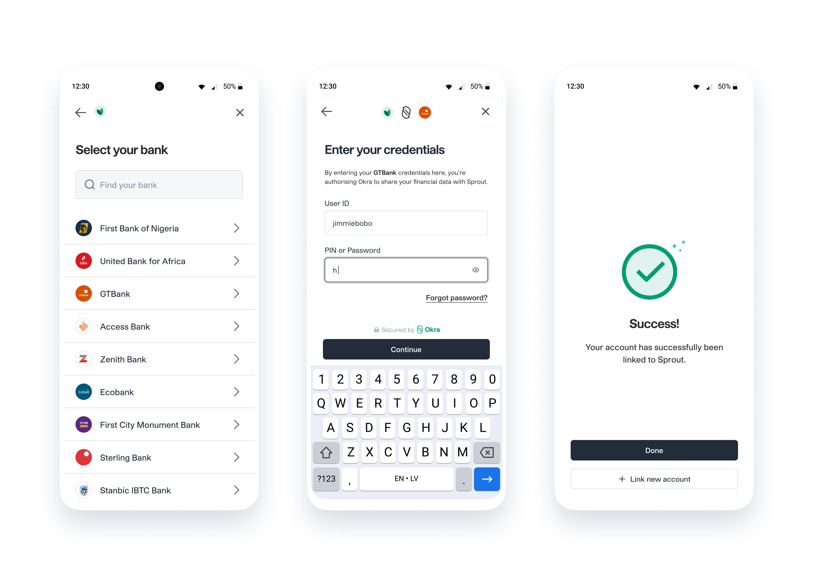

# Okra Widget Flutter SDK


Flutter SDK for implementing the Okra widget - Okra is a safe and secure web drop-in module and this library provides a front-end web (also available in [iOS](https://github.com/okraHQ/okra-ios-sdk), [Android](https://github.com/okraHQ/okra-android-sdk), and [JavaScript](https://github.com/okraHQ/okra-js)) SDK for [account authentication](https://docs.okra.ng/docs/widget-properties) and [payment initiation](https://docs.okra.ng/docs/creating-a-charge) for each bank that Okra [supports](https://docs.okra.ng/docs/bank-coverage).

## Try the demo
Checkout the [widget flow](https://docs.okra.ng/docs/widget-flow/) to view how the Okra Widget works.

## Before getting started
- Checkout our [get started guide](https://docs.okra.ng/docs/onboarding-guide) to create your developer account and retrieve your Client Token, API Keys, and Private Keys.
- Create a [sandbox customer](https://docs.okra.ng/docs/using-sandbox), so you can get connecting immediately.

*Bonus Points*
- Setup [Slack Notifications](https://docs.okra.ng/docs/slack-integration) so you can see your API call statuses and re-run calls in real-time!

### Getting Started
This library would help you add Okra widget to your hybrid android/ios application in no time. All you need to do is ...

### Install
To use this plugin, add `okra_widget` as a [dependency in your pubspec.yaml file](https://flutter.io/platform-plugins/).
```pub
dependencies:
  okra_widget: ^3.1.10
```

On iOS, opt-in to the embedded views preview and also enable Arbitrary loads by adding the following configs
to the app's Info.plist file

```plist
    <key>io.flutter.embedded_views_preview</key>
	<string>YES</string>
	<key>NSAppTransportSecurity</key>
    <dict>
        <key>NSAllowsArbitraryLoads</key>
        <true/>
        <key>NSAllowsArbitraryLoadsInWebContent</key>
        <true/>
    </dict>
```

### Usage
#### Build with options
```dart
var banks = [
                    "ecobank-nigeria",
                    "fidelity-bank",
                    "first-bank-of-nigeria",
                    "first-city-monument-bank",
                    "guaranty-trust-bank",
                    "access-bank",
                    "unity-bank",
                    "alat",
                    "polaris-bank",
                    "stanbic-ibtc-bank",
                    "standard-chartered-bank",
                    "sterling-bank",
                    "union-bank-of-nigeria",
                    "united-bank-for-africa",
                    "wema-bank",
                    "rubies-bank",
                    "kuda-bank"
                  ];

                  Okra.buildWithOptions(context,
                                        key: "3f52ee9d-f081-55a7-a9d8-73d4b5878bd2",
                                        token: "5da6358130a943486f33dced",
                                        color: "#3AB795",
                                        products: ['auth', 'identity', 'balance', 'transactions'],
                                        chargeAmount: 1000,
                                        chargeNote: "testing",
                                        chargeType: "one-time",
                                        chargeCurrency: "NGN",
                                        environment: "production",
                                        clientName: "clientName",
                                        customerBvn: "22188789177",
                                        meta: "Dynamic data type",
                                        options: {
                                          "name": "Test Map"
                                        } 
                                        logo:
                                            "https://dash.okra.ng/static/media/okra-logo.514fd943.png",
                                        limit: 3,
                                        currency: "NGN",
                                        isCorporate: false,
                                        showBalance: true,
                                        geoLocation: true,
                                        payment: false,
                                        connectMessage:
                                            "Which account do you want to connect with?",
                                        callbackUrl: "",
                                        redirectUrl: "",
                                        widgetSuccess:
                                            "Your account was successfully linked to SwipeNG",
                                        widgetFailed:
                                            "An unknown error occurred, please try again.",
                                        guarantors: {
                                          "status": false,
                                          "message": "Okra requires you to add guarantors",
                                          "number": 3,
                                        },
                                        filters: {"industry_type": "all", "banks": banks},
                                        onSuccess: (data) {
                                      print("Success");
                                      print(data);
                                    }, onError: (message) {
                                      print("error");
                                      print(message);
                                    }, onClose: (message) {
                                      print("close");
                                      print(message);
                                    });
```


#### Build with shortUrl
``` dart

                Okra.buildWithShortUrl(
                        context,
                        shortUrl: "ns_aIEz8r",
                        onSuccess: (data) {
                          print("Success");
                          print(data);
                        },
                        onError: ( message) {
                          print("error");
                          print(message);
                        },
                        onClose: (message) {
                          print("close");
                          print(message);
                        }
                    );
```
## Okra.buildWithOptions Options

| Name             | Type          | Required | Default Value       | Description                                                                         |
|------------------|---------------|----------|---------------------|-------------------------------------------------------------------------------------|
| `app_id `        | `String`      | true     |                     | Your app id from your Okra Dashboard.                                               |
| `okraKey `       | `String`      | true     |                     | Your public key from your Okra Dashboard.                                           |
| `token `         | `String`      | true     |                     | Your token from your Okra Dashboard.                                                |
| `env `           | `String`      | false    | `production`        | production(live)/production-sandbox (test)                                          |
| `products`       | `Array`       | true     | `['Auth']`          | The Okra products you want to use with the widget.                                  |
| `payment`        | `Booelan`     | false    |                     | Whether you want to initiate a payment (https://docs.okra.ng/docs/payments)         |
| `charge `        | `Object`      | false    |                     | Payment charge opject (https://docs.okra.ng/docs/widget-properties#set-up-payments) |
| `products`       | `Array`       | true     | `['Auth']`          | The Okra products you want to use with the widget.                                  |
| `logo `          | `String(URL)` | false    | Okra's Logo         |                                                                                     |
| `name `          | `String`      | false    | Your Company's name | Name on the widget                                                                  |
| `color`          | `HEX   `      | false    | #3AB795             | Theme on the widget                                                                 |
| `limit`          | `Number`      | false    | 24                  | Statement length                                                                    |
| `filter`         | `Object`      | false    |                     | Filter for widget                                                                   |
| `isCorporate`    | `Boolen`      | false    | `false`             | Corporate or Individual account                                                     |
| `connectMessage` | `String`      | false    |                     | Instruction to connnect account                                                     |
| `widget_success` | `String`      | false    |                     | Widget Success Message                                                              |
| `widget_failed`  | `String`      | false    |                     | Widget Failed Message                                                               |
| `callback_url`   | `String(Url)` | false    |                     |                                                                                     |
| `currency`       | `String`      | false    | NGN                 | Wallet to bill                                                                      |
| `exp`            | `Date`        | false    | Won't expire        | Expirary date of widget                                                             |
| `options`        | `Object`      | false    |                     | You can pass a object custom values eg id                                           |
| `onSuccess`      | `Function`    | false    |                     | Action to perform after widget is successful                                        |
| `onClose`        | `Function`    | false    |                     | Action to perform if widget is closed                                               |
| `onError`        | `Function`    | false    |                     | Action to perform on widget Error                                                   |
| `BeforeClose`    | `Function`    | false    |                     | Action to perform before widget close                                               |
| `onEvent`        | `Function`    | false    |                     | Action to perform on widget event                                                   |

View a complete list of customizable options [here](https://docs.okra.ng/docs/widget-properties)

## Okra.buildWithShortUrl Options

| Name          | Type       | Required | Description                                                                                |
|---------------|------------|----------|--------------------------------------------------------------------------------------------|
| `short_url`   | `String`   | true     | Your generated url from our [App builder](https://docs.okra.ng/docs/widget-customization). |
| `onSuccess`   | `Function` | false    | Action to perform after widget is successful                                               |
| `onClose`     | `Function` | false    | Action to perform if widget is closed                                                      |
| `onError`     | `Function` | false    | Action to perform on widget Error                                                          |
| `BeforeClose` | `Function` | false    | Action to perform before widget close                                                      |
| `onEvent`     | `Function` | false    |                                                                                            | Action to perform on widget event


## Done connecting?
Checkout our [API Overiview](https://docs.okra.ng/docs/api-overview) and see how to use the data you've received and [other products](https://docs.okra.ng/docs/selfie-verification) you can use to create more personalized experiences for your customers!

## Not a developer?
Get started without writing a single line of code, Try our App Builder! [Click here to get started](https://docs.okra.ng/docs/widget-customization)

## Other information
For enquires and questions, contact
- support@okra.ng